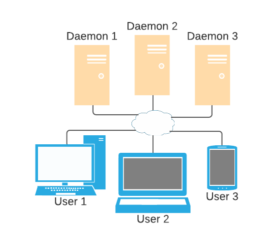
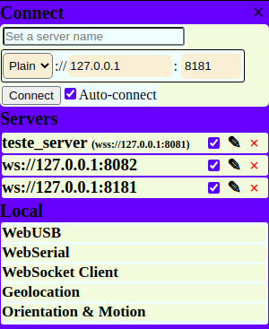
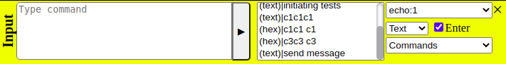
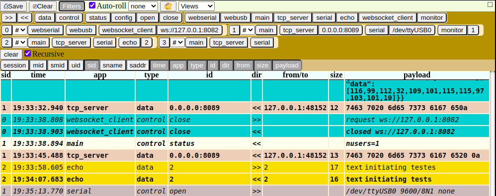
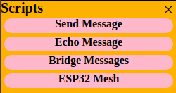
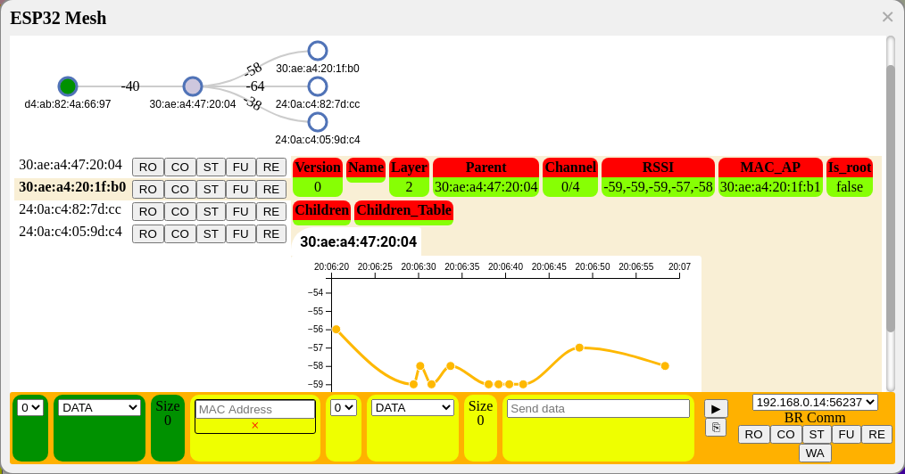

# Xerock

**Xerock** is a set o tools (Linux and Windows) to assist the development of low level communication between devices. The plataform aims different kinds of connections, since physical connection (e.g. serial) to network protocols (e.g. TCP, WebSocket).

The application is divided into *daemon* ([daemon project](https://github.com/rnascunha/xerock)) and *interface* (this project). You can access the *interface* at [this address](https://rnascunha.github.io/xerock/).

The *daemon* is where the connections/protocols will be running, and at the *interface* you can access *daemons* (as many as you need) to interact/viasualize the data. All people connected to the same *daemon* will receive the same data traffic.

The software is composed by:

* _Apps_ : applications provide the resources that the system will work on top. For example, the *Serial App* connects to serial ports, *TCP Server App* open listening tcp sockets, and so on.

* _Data_ / _Views_ : this module is all about visualization. The default view shows all data, from all the *apps*, from all *daemons*, and all metadata involved (timestamp, app, size, data...). There is also custom views, where data can be filterd, parsed and displayed in different ways.

* _Input_ / _Commands_ : here is how you send data to the *apps*. You can send data as **text**, **hexadecimal** or **binary**. Custom inputs, called *commads*, can be used to construct more complex data sets.

* _Scripts_ : scripts are used to automated some procedure. For example, echoing all data received from some socket, or bridging data received from a serial port to a TCP socket, or vice-versa.

* _Tools_ : tools are features to help develoment, but not tightly related with others. Some examples are data conversion or open saved data.

All features above are extensible, i.e., new *Apps*, *Views* , *Commands*, *Scripts* and *Tools* will be added in the future.

## How it works

 

* Users access the [interface](https://rnascunha.github.io/xerock/);

* At interface, users can connect to any the *daemons* they need;

* Users can send commands to *daemons* to open serial ports, open sockets, or any other resources the *daemon* provide. Different *daemons* require different type of connections (plain or SSL), and can be compiled with different sets of  _apps_ ;

* All data is shared by the users that are connected to the same *daemon* .

Other possibility, that does't require a *daemon* , is the **local apps** . **Local apps** are applications that use some API supplied by the browser. As everything runs locally, the data isn't shared, but all features described above ( _Viwes_ ,  _Commands_ ,  _Scripts_ ) are still valid.

## Compile

You can access the interface directly by [this address](https://rnascunha.github.io/xerock/), but if you want to modify, compile or use at your own web server, follow this steps.

* Download and install [nodejs](https://nodejs.org)/[npm](https://www.npmjs.com/). Instructions installation to your system can be checked [here](https://nodejs.org/en/download/package-manager).

* Clone source code:

```
$ git clone https://github.com/rnascunha/xerock_web
$ cd xerock_web
```
* Compile:

```
$ npm run build
```
All files will be avaiable at **dist/** directory. Put them at a web server, or you can test using:

```
$ npx http-server dist/
```
Open your browser at **http://127.0.0.1:8080** (if you are running locally).

## How to use

> :warning: The website is no responsive (yet).

> :warning: All features are just fully functional at Chrome.

I think the best way to learn how to use something, is using. So just give a try [here](https://rnascunha.github.io/xerock/). But if you really want to know the minor details, keep reading.

The *interface* is divided in 5 views:

* [Header](#header): red view at the top;

* [Options](#options): blue view at the right;

* [Input](#input): yellow view at the bottom;

* [Data](#data): green view at the middle;

* [Scripts](#scripts): orange view at the left (closed by default);

[Options](#options), [input](#input), [scripts](#scripts) are closeable. [Data](#data) can be maximized/minimized. At the [header](#header) you can toggle the views.

### Header


At **header** you can:

* Manage [profiles](#profile): at left;

* Open tools (🛠);

* Toggle views: [scripts](#scripts) (∑), [input](#input) (∀) and [options](#options) (☰);

* [Configure](#configure) (⚙);

* About (©): basic info about the project. 

#### Profile

Profiles are a way to save/load configuration of **Xerock**. You can create as many profiles as you need, and toggle between them accessing the select box. The following configuration are saved:

* **Input**: *input type* and *enter to send*;

* **Data**: *output type* and *auto-roll*;

* [Types/Time format](#types-time-format);

* [Select](#select);

* [Filter](#filter):

* [Custom paint](#custom-paint);

* [Storage](#storage);

* **Command history**: last input commands sent;

To create a new profile, select the **New profile** option and choose a name. The new profile will have the current configuration. To save new changes, you must hit the save button (💾).

The **Default** option at the select box will load the fabric configuration.

To load a profile configuration, just select it at the box. Load is done selectively, so just the items checked at the dropbox (▼) will be updated. To reload a already selected profile, hit the reload button (↻).

To drop a profile, use the delete button (🗑), or go to the [storage](#storage) menu.

A default profile (name *current*) is saved automatically at any changes you make.

#### Configure

General configuration of **Xerock**.

##### Types/Time format

At **types** section:

* *Append input* option will append any data that you send at [input](#input). The option are *\n* (0x0a), *\r* (0x0d), *\n\r* (0x0a0d) or any custom character.

* interpret [escaped strings](#escaped-string) at [input](#input).

At **time format** you select how the datetime of the data sent/received will be visualized. 

##### Storage

At the storage tab you can manipule persistent data/configuration. Persistent data are retained between sessions. 

At the **save data** section, checking the checkbox all data that satisfy the [filter](#filter) will be saved.

At **clear data** you can delete all data that satify the [filter](#filter).

Every time you succefully [connect](#connect) to a *daemon*, this connection is saved. At **Connections** you can manage this information (visualize, delete and configure).

[Profiles](#profile) are also saved at database. You can delete them at **Profiles** section. 

The **Clear all data** button, as the name suggest, clears all data.

### Options



The **options view** is where you connect to the *daemons* and use the *apps*.

#### Connect

To connect to a *daemon* is mandatory to provide:

* Protocol (*plain* or *SSL*);

* *URL* or *IP*;

* and a port. 

You can optionally give a name to the server at the first field. Also, any previously successfull connection will be stored and listed. The auto-connect checkbox, if checked, will make the interface try to connect automatically next access.

#### Servers

The **Servers** section you can access all the *daemon* you are connected. At any servers you can:

* Select/unselect auto-connect option;

* Edit server name (✎);

* Close server (X);

At connection it be informed a *Server ID* (SID) and a *Session* number. *SID* is unique to you, i.e., others users connected to the same *daemon* will have different numbers, and is persistent between access. *Session* is updated every time you connect the *daemon*, or hitting the '+' button. You can also [filter](#filter) data by session. 

You will receive from the *daemon*:

* A *User ID* (UID) number (a new one every time you connect);

* The total number of users connected;

* The list of *apps* it supports.

At last, it's showed all the apps to use.

[Local apps](#local) have a 'fake' server associated to it with the parameters as shown: 

* *SID* : 0;

* *Server name*: local;

* *UID*: 1;

* Address: local://127.0.0.1:0.

#### Local

The **Local** section shows all *local apps*. *Local apps* are applications that doesn't require a *daemon*, they use some API provided by the browser. Only supported *local apps* displayed, i.e., different browsers at different version will exibit different *local apps* list.

The list of *local apps* can be examined [here](#local-apps).

### Input



At **input view** you can send data to any resources (provided by the apps). The fields are:

* *Data*: is where you type the data to send. It only accept characters accordingly to the selected *input type* (and space (' ')). *ESC* key will erase any data typed;

* *Command history*: every data sent is saved here. Clicking at the data will fill the *data* field with it, double clicking will send it. If the cursor is at the *data* field, you can also navigate *command history* with up and down arrow;

* *IDs list*: every resource a *app* provide is called *ID*. The *ID list* is where you choose to whom you will send. Every *ID* is identified by **Server:App:ID**;

* *Input type*: the type to interpret the *data* field. The supported types are: **text**, **hexa** (hexadecimal), **binary**;

* *Enter to send*: if checked, when you press 'Enter' key at the data field, data will be sent;

* [Commands](#commands): commands are custom data constructors.

#### Escaped string

If checked at [configure](#configure) > [types](#types-time-format), any escaped ('\') data at *data* field, when **text** type is selected, is interpreted as follows:

Escaped string | Hexadecimal|Name
---------------|------------|----
\0|0x00|Null
\a|0x07|Alert
\b|0x08|Backspace
\e|0x1B|Escape
\f|0x0C|Formfeed
\n|0x0A|Newline
\r|0x0D|Carriage Return
\t|0x09|Horizontal Tab
\v|0x0B|Vertical Tab
\\|0x5C|Backslash

Also, any sequence of pattern '\xh' or '\xhh', where 'h' is a hexadecimal (i.e., [0-9a-fA-F]) will be interpreted as the correponding byte. This is also the way that non-ASCII data is displayed at output, when *output type* is selected to **text**. 

### Data



**Data view** is where you can visualize all data sent/received. The default view is displayed in a table form. Custom views can be checked [here](#view).

The data/metadata presented at the default view are:

* **Session**: server session number ([more here](#servers));

* **Message ID (mid)**: a message number assosiated to the *interface*;

* **Server Message ID (smid)**: a message number assosiated to the *daemon*. All users connected to the same *daemon* will see the same number (to the same data);

* **User ID (uid)**: user identification. Each *daemon* connected, you will receive a different *uid* ([more here](#servers));

* **Server ID (sid)**: unique identification of server ([more here](#servers));

* **Server name (sname)**: the server name (if any);

* **Server address (saddr)**: the server address;

* **Time**: datetime of data sent/received. The format of this field can be configured at [configure](#configure) > [time format](#types-time-format). Data from *daemons* have the time computed at the *daemon* (sent or received);

* **App**: *app* the data is binded;

* **Type**: type of data; it can be *data* or *control*. *Control* type are message to manipule tha *app* (e.g, open/close socket);

* **ID**: to *control* types, this field will show what kind of control message is. To *data* message types, is the ID associated to the data;

* **From/to**: who sent the data. This field is just meaningful to *apps* hava a relationship of "1 to many", e.g., one TCP socket (listening) can have lots of clients. This field will indicate which client;

* **Size**: size of the payload. Just used at *data* type message;

* **Payload**: the payload of the message, i.e., the data transfered. Payloads may have more informantion depending of the *app*.

When you click at a message, it will open a modal with all this information, and you can toggle the payload to diffent *output types*. The right click also show some more options. 

At the top of the **data view**, you have:

* [Save](#save-to-file) data a file;

* *Clear* data: will delete (even from storage) all data. You can selectively delete data at [configure](#configure) > [storage](#storage) > clear data; 

> :warning: It may be necessary to clear data from time to time. The increase use of memory can slow down the interface. At the time of writing, no limit to control the amount of data was implemented (to be done). If you need the data, [save](#save-to-file) it.

* *Filter*: toggle filter/select menu. [Filter](#filter) is the action to filter lines, and [select](#select) to select columns;

* *Auto-roll*: automatically scroll view;

* *Output type*: select how the data payload will be displayed. **None** type will show as **text** when data is of type string, otherwise **hexadecimal**. Other types are **text**, **hexadecimal** and **binary**;

* [Custom paint](#custom-paint) (🎨) data;

* [View](#view): custom visualization of data.

#### Save to file

All data can be saved to a file. The supported formats are *HTML*, *CSV* and *JSON*.

The *JSON* format is to be opened at [tools](#tools) > [data viewer](https://rnascunha.github.io/xerock/tools/data_viewer.html). All data that satisfy the filter is saved. All options selected (date/time, payload and select) will be just default configuration at the [data viewer](https://rnascunha.github.io/xerock/tools/data_viewer.html), that can be changed later.

The *CSV* and *HTML* the data is static and need to be opened/manipulated by a external program.  
 
#### Filter

**Filter** is a method to filter messages, and used in many places across the application. At default view, just the lines (messages) that satisfy the filter will be displayed. The filter is constructed as data is sent/received.

To satisfy the filter:

1. the message must satisfy all *groups*; 

1. If nothing is selected at a *group*, the message satisfy the *group*;

1. If one or more item is selected at a *group*, the message must satisfy one of them;

1. If the *group* has *subgroups*, and a *subgroup* is selected (without selecting the upper *group*), it will only filter the *subgroup* inside the *group* (all data that doesn't belong to the upper *group* is untouched);

As the last rule may seem unnatural, when the *Recursive* checkbox is checked, if you select a *subgroup*, all upper *groups* will also be selected.

The filter *groups* are:

* Data direction: *sent(>>)* / *received(<<)*;

* Data type: *data* / *control*;

* Control type: *status* / *config* / *open* / *close* / *custom* / *error*;

* Application: filter any message that belongs to the selected *apps*, regardless of the server;

* Server: filter messages of the selected servers. It contain as subgroups all *apps*, and *apps* contain as subgroups all *IDs* (subsubgroup of server). You can also filter messages per session;

#### Select

**Select** is how you display only the columns you need. All columns where explained [here](#data). 

Some columns may not be useful in certain context, e.g, if you are connect to just one server, the columns *sid*, *sname* and *saddr* may not be important. *UID* is just meaningful if more than one user is connected... and so on. Using [custom paint](#custom-paint) is possible to omit other columns.

Clicking at the header of default view will hide the column.

#### Custom paint

**Custom paint** is a method to style the line/message at the default view. 

When you add a new **custom paint**, you select all style options, and a [filter](#filter). If the message satisfy the filter, the selected style will be applied. After a match, it stop searching (there is no accumulative style). If none of the **custom paint** match, the default style (that is also configureable) will be applied. A hover style is also configurable.

The style options are background-color and font (color, weight, style, size and family).

The default configuration of **custom paint** is:

* Each *app* has a different background-color;

* Data messages received are bold, data messages sent are normal;

* Control messages received are bold/italic, control messages sent are italic;

### Scripts



**Scripts** is a method to automate some functionality. It works on both [daemon apps](#daemon-apps) and [local apps](#local-apps). Not all scripts works on all *apps*. For example, the *Echo Script*, that echoes messages, if used with the *echo app*, would exchange messages forever, so it's exclude.

A list of all scripts can be found [here](#script).

## Applications

### Daemon apps

**Daemon apps** runs at the daemon. A detailed explanation can be found [here](https://github.com/rnascunha/xerock#applications).

### Local apps

**Local apps** runs directly at the browser, so it relies on the browser to provide the necessary API.

#### WebUSB

**API**: 'usb' in navigator ([spec](https://wicg.github.io/webusb/)|[support](https://caniuse.com/webusb)).

> :warning: This API is not fully functional. It's was intended to develop specific drivers to specific applications ([USB development](https://www.beyondlogic.org/usbnutshell/usb1.shtml)). Also, if your OS already have drivers installed, it will conflict and fail.

> :warning: As the drivers provided now are just for serial devices, is highly recommended to use the [WebSerial](#webserial) *app*.

To begin, you must provide a filter option and click 'Request', so the browser can find the devices connected. At linux you can find this parameters using:

```
$ lsusb 
Bus 002 Device 006: ID 10c4:ea60 Cygnal Integrated Products, Inc. CP210x UART Bridge / myAVR mySmartUSB light
...

```

*IdVendor* is **0x10c4** and *idProduct* **0xea60** ('**0x**' needed). A system window will open to choose your device and connect. This procedure is just needed at the first time. After that, just click at the 'Update' button. The device name will appear at the devices list. Hovering the open button (►) you can choose the appropriate driver.

The drivers implemented are:

* *USB CDC*: communications device class. Serial options are locked at 115200 8N1;

* *CP210x*: CP21x family. Serial options are locked 9600 8N1;

If the error 'NetworkError: Unable to claim interface' appear is because of conflict with the system driver. At linux you can unbind the system driver:

```
sudo sh -c 'echo -n "<bus>-<port>:1.0" > /sys/bus/usb/drivers/<driver>/unbind'
```

#### WebSerial

**API**: 'serial' in navigator ([spec](https://wicg.github.io/serial/))

> :warning: WebSerial! Just love it! But it's seems to be a work in progress. Depending your browser version, it my break something.

> :warning: It's not very well supported. Try to use Chrome (updated!).

Just hit the 'Request' button and a system menu with all the serial options will appear. Choose your device. This procedure is just needed the first time. After that, just click the 'Update' button. The serial device will appear at the devices list (with the name 'Port + number').

Choose the serial configuration and click the open button (►). You can also mess around with the signals *Data Terminal Ready (DTS)*, *Request to Send (RTS)* and *Break (BRK)*.  

#### Websocket Client

**API**: 'WebSocket' in window ([support](https://caniuse.com/mdn-api_websocket));

To use the **Websocket Client**, provide the URL (protocol, domain name/ip and port) you want to connect and click the open button (►). If successfully connect, the socket will appear at the socket list.

If you have any *daemon* running, you can connect to it using this *app*. Just fill the daemon address and click open. You will receive all data at the payload, as you whore a client. If you send any data to the daemon and the data is ill formed (probably), you will receive a error message.

#### Geolocation

> :iphone: This *app* was intented to be used at mobile devices

**API**: 'geolocation' in navigator ([spec](https://w3c.github.io/geolocation-api/)|[support](https://caniuse.com/geolocation))

Click the globe button (🌐) and the *app* will inform any geolocation data, as:

* Timestamp;

* Latitude and longiture;

* Accuracy (acc);

* Altitude (alt);

* Altitude accuracy (alt_acc_;

* Heading (head);

* speed (speed);

Non-valid data will be omitted. You can enable *High Accuracy*, and configure *maximum age* and *timeout*. The *Watch position* option, if marked, will continually inform geolocation data.

For test purposes, at Chrome you can simulate your location. Open DevTools > More Tools > Sensors.

#### Orientation/Motion

> :iphone: This *app* was intented to be used at mobile devices

**API**: 'DeviceMotionEvent' in window ([support](https://caniuse.com/mdn-api_devicemotionevent)) and 'DeviceOrientationEvent' in window ([support](https://caniuse.com/mdn-api_deviceorientationevent))
		
Inform device motion and orientation. First you need to install the listeners. Then just click the request button (✥) and the information will be displayed. You can selectively choose what information to show, and request to be displayed regulary (*Watch position*). 

For test purposes, at Chrome you can simulate orientation info. Open DevTools > More Tools > Sensors.

## Modules

All features described at this section are extensible. New ones will be added in the future.

### Commands

**Commands** are features intended to construct complex input data. 

**Commands** will open as a draggable containers, and follow the same pattern: 

* one click copy data to [input view](#input) data field;

* Two clicks send data;

Follow the description of all implemented **commands**.  

#### Ebyte Radio

A very simple and incomplete configuration commands of Ebyte Radios. The commands are:

* Reading operation parameters;

* Reading version number;

* Reset device.

Keeped for sentimental reasons...

#### Custom Input

With this command you can create complex arrays of data, of different types. You can add as many fields you need clicking the 'plus' (+) button. The types supported are: 

* text, hexa, binary;

* interger , unsigned interger: 8 bits;

* interger , unsigned interger: 16, 32,and 64 bits, big and little endian.

One field can have more than one number, separating with space (' ') character.

#### ESP32 BR

Protocol developed to be used at the [ESP32 Mesh](#esp32-mesh) script. It send data/configuration commands to ESP32 microcontrollers flashed with [Xerock Mesh](https://github.com/rnascunha/xerock_mesh) firmware.

#### JSON Message

This command simulate the messages exchanged between **Xerock** *daemon* and *interface*. This is more a development tool, but feel free to use it.

### View

> :warning: At the time, *views* are only avaiable on Chrome browser. 

Visualize/analyze data disposed at a table may not be the best way in some cases, so **views** are a alternative. It will open at a new window, and you can open as many as you need.

If you close the main window, the opened views will also close.

#### Terminal View

**Terminal View** is sutiable when you are transfering text data type (it's useless otherwise). It will display the payload data of the chosen resource, and treat as a system terminal. 

It will interpret special character like coloring. By default it will show only data received, and new lines need to be sent as '\r\n' (0x0d0a). The options *Show send message* and *Convert EOL* (*convert EOL* converts '\n' in '\r\n') changes this behaviour.

For your pleasure, you can choose a dark or light theme (◐).

### Script

As stated previously, [scripts](#scripts) are a way to automate some functionality. Follow the implemented scripts.

> Some scripts have the checkbox **ID match exactly**. This impacts only resources that have '1 to many' relationship (by the time of writing, just *TCP Server App*, i.e., one server can have many clients). For each of this type of resource, will be created two generic *IDs* ('1 to N', and '1 to all' relationship), and one for each client. When you start a script, you will choose one of this *IDs*. This option (**ID match exactly**) is about how to check if the received data matches the chosen *ID*. The generic *IDs* ALWAYS match (the option is ignored), but the *IDs* of specific clients, if checked, will match only if the data received is from that exactly client. If not checked, any data from any client will be considered a match. This may sound complicated, but makes the use of scripts more general.

#### Send message

Sends messages to the chosen *ID*, at a regular interval time. You can configure:

* The *ID* to send;

* Number of messages;

* Data that will be sent: data is of *text type* (not interpreted as [escaped](#escaped-string)) and it will be sent at the format *[<run>] <data> <num>*, where *<run>* is a fixed interger incremented each time you run the script, *<data>* is the input data and *<num>* is the message number at this 'run'; 

* Interval (at miliseconds) between messages.

#### Echo message

**Echo Message** is a script to echo messages... It's great to test if the comunication (both sides) are working properly. It exclude the *Echo App* as both sides would echo messages endlessly.

#### Bridge message

**Bridge Message** script will connect two *IDs*. All messages received by one will be sent to the other, and vice versa.

For example, if you choose *ID1* from [WebSerial](#webserial) [local app](#local-apps), and *ID2* from *TCP Server App* [daemon app](#daemon-apps) you will share a local data with any one connected to the open TCP socket.

#### ESP32 Mesh

This script is used to manage [ESP32 devices](https://www.espressif.com/en/products/socs/esp32/resources) in a [mesh network](https://docs.espressif.com/projects/esp-idf/en/latest/esp32/api-reference/network/esp_mesh.html). The devices must be flashed with [Xerock Mesh](https://github.com/rnascunha/xerock_mesh) firmware, and will send data through a TCP socket.

Configure the devices accordingly (WiFi SSID and password, socket IP/port...), open the local socket at *TCP Server App* and run the script. If everything is correct, you will be able to see the devices connecting and sending messages, and visualize the mesh tree and link quality of the devices.

As said, it only accept *IDs* from *TCP Server App*. Let the *Auto-send messages* option marked, and the script will take care to send all messages to build the tree.

 

### Tools

Tools are features to support the use of **Xerock**, but are independet from it. You can access a tool direct by the link address, or at the tool menu at the [header](#header).

#### Data Viewer

The **data viewer** tool is used to open the data [saved](#save-to-file) as JSON. Looks a lot like the the **Xerock** with just the [data view](#data). You can open more than one file at the time, and one more column is added:

* **File name (file)**: the name of the file.

You can use all the features showed at [data view](#data), including the [views](#view).

Link: [https://rnascunha.github.io/xerock/tools/data_viewer.html](https://rnascunha.github.io/xerock/tools/data_viewer.html)

#### Data Converter

A convert binary data tool.

Link: [https://rnascunha.github.io/xerock/tools/data_converter.html](https://rnascunha.github.io/xerock/tools/data_converter.html)

#### Filter Tester

This is a development tool, but can also be used to understand better the use of [filters](#filter). It shows a filter created with some dummy data, and it displays how it's stored internally.

Link: [https://rnascunha.github.io/xerock/tools/filter_tester.html](https://rnascunha.github.io/xerock/tools/filter_tester.html)